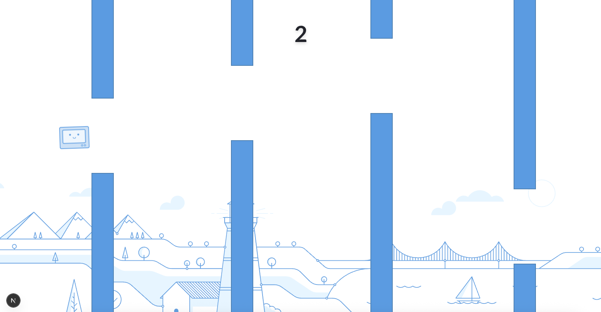

# Flappy Bot

A [Metabase](https://metabase.com) themed Flappy Bird game built with Next.js, featuring blue bar charts and a metabot character.



## Features

- Classic Flappy Bird gameplay mechanics
- Metabot character as the player
- Blue bar charts as obstacles
- Tech-themed design with glassmorphism UI
- Fullscreen responsive gameplay
- Fast-paced scrolling action

## Getting Started

1. Install dependencies:

```bash
npm install
```

2. Run the development server:

```bash
npm run dev
```

3. Open [http://localhost:3000](http://localhost:3000) to play!

## How to Play

- **Click** or **press spacebar** to make your metabot jump
- Navigate through blue bar charts
- Avoid hitting the bar charts, ground, or ceiling
- Score points by successfully passing through bar charts
- Click anywhere when game over to restart

## Tech Stack

- Next.js 15
- TypeScript
- Tailwind CSS
- React Hooks

## Game Assets

- `metabot.svg` - The player character
- `background.svg` - Scrolling background
- `icon.svg` - Game favicon

Enjoy playing Flappy Bot!
